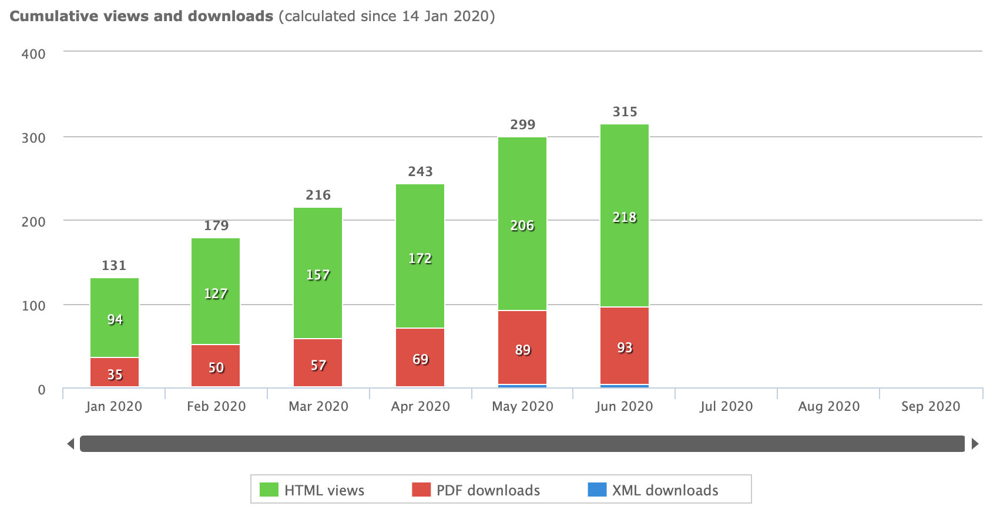

+++
title = "The SHUD model description paper is published on Geoscientific Model Development"
date = "2020-06-18"
draft = false

# Tags and categories
# For example, use `tags = []` for no tags, or the form `tags = ["A Tag", "Another Tag"]` for one or more tags.
tags = ["News", "Website", "SHUD", "SHUDtool"]
categories = []

# Featured image
# To use, add an image named `featured.jpg/png` to your page's folder.
[image]
  # Caption (optional)
  caption = ""

  # Focal point (optional)
  # Options: Smart, Center, TopLeft, Top, TopRight, Left, Right, BottomLeft, Bottom, BottomRight
  focal_point = ""
+++
The SHUD model description paper is published on the Geoscientific Model Development.

Total readers is more than 300 after the preprint.

Web page: https://www.geosci-model-dev.net/13/2743/2020/

PDF link: https://www.geosci-model-dev.net/13/2743/2020/gmd-13-2743-2020.pdf

*Thanks to the editor Dr. Andrew Wickert and two anonymous referees.*
