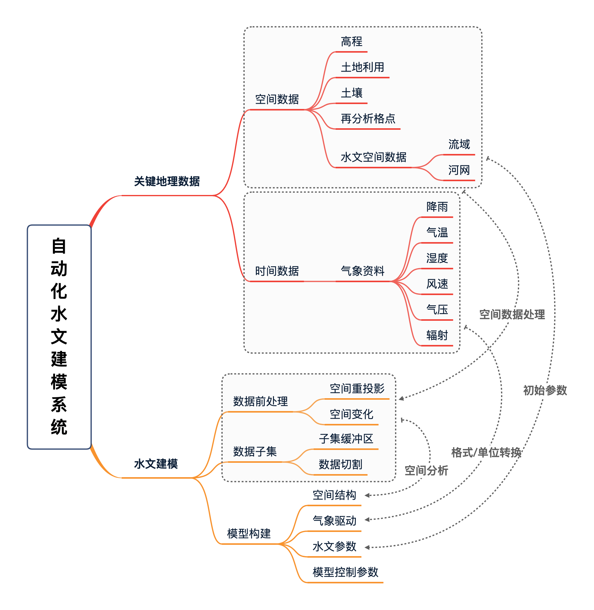

**通过自动化程序收集公开的全球基础地理数据，同时建立一套自动化数据处理系统，为水文建模用户快速提供研究区所需要的关键地理数据和水文模型输入数据。**

## 研究目标

研究旨在降低水文模型数据收集和输入数据准备的障碍，提高水文建模效率，同时提高水文模拟的可重复性，形成标准化的水文建模流程和工具。
用于水文建模的基础数据分布于不同的数据库和数据中心，尚无集中的数据分享平台，因此用户本身需要通过不同渠道获取数据。并且数据的格式、变量含义、变量单位各有不同，建模用户需要较长时间方能为其研究区建立合理的水文模型数据集，费时费力，阻碍了数据应用和模拟工作。因此针对水文建模数据的的标准化、统一化和格式化势在必行。本项目将在程序内实现水文建模的关键地理数据的标准化、格式化和统一化。

项目拟选择Topmodel和SHUD模型作为示例展示自动化水文建模系统。水文模型粗略可分为集总式模型、半分布式模型和分布式模型；其中集总式模型对地形和水文参数需求较低，建模过程简单，无需本系统辅助，因此本系统主要服务对象是半分布式和分布式模型。

Topmodel是半分布式水文模型，在全球各地都有应用，应用范围广、效果好；SHUD模型是典型数值方法水文模型，对空间数据和水文数据要求高，模型构建较为复杂，因此本系统建立可有效提高数值方法水文模型构建的效率。

## 技术路线

研究任务分解为两个部分，数据和自动建模程序。
### 任务1：收集关键地理数据
利用自动化程序收集全球公开的水文关键地理数据。数据收集包括空间数据和时间序列数据。空间数据主要是构建水文模型所需要的与空间信息或水文参数有关的数据，包括高程、流域边界、河流、土壤质地、土地利用、再分析资料格点位置等。时间序列数据主要指气象数据，即用于驱动水文模型的降雨、气温、湿度、风速、气压和辐射数据。

表1列举了本研究所需要的数据以及数据来源等信息，所列举的数据为开放版权(Public Domain)，即允许数据处理后再发布。 部分数据已经在申请人前期研究中获得，在本项目执行中将更新或补全。部分数据的更新周期较慢；对于实时更新的数据（如再分析气象数据），则通过程序自动下载。

| 数据分类	| 数据	| 备选数据源	| 分辨率 |
|-----|-----|-----|-----|
| 地理	| 高程	| ASTER GDEM v3.0, MERIT Hydro	| 30m/90m |
| 地理	| 土壤质地	| HWSD	| 1km |
| 地理	| 土地利用	| USGS Global Land Cover | 	1km |
| 地理	| 河网	| HydroSHEDS | 	- |
| 地理	| 流域边界	| HydroSHEDS | 	- |
| 气象	| 再分析资料	| GLDAS，NLDAS，FLDAS	| 0.25, 1度 |

### 任务2：自动化水文建模
自动化建模过程包括三个基本步骤：数据前处理、提取数据子集和生成模型输入文件。数据前处理负责对空间数据进行重投影、坐标变换和格式转换。数据子集提取模块负责从全球数据中寻找研究区范围内的数据；首先依据研究区图层，生成大于研究区的缓冲区，数据子集提取以缓冲区为准，防止出现后期数据处理产生的空值情况。模型构建模块需根据用户提供的研究区边界和所使用的水文模型，建立模型空间结构、气象数据、水文参数和模型控制参数四类模型输入文件。

- 空间结构只水文模型使用的水文计算单元以及计算单元间的拓扑关系；
- 气象数据符合模型规定的驱动数据格式；
- 水文参数是由地形地貌、土地利用、土壤质地的数据而生产的模型参数，例如Pendo-Transfer Function可依据土壤沙、壤和有机物组分计算饱和水力传导度、土壤孔隙度等等水力学参数；
- 模型控制数据包括模型输入输出配置、模型运行起始时间、模型调参文件、并行化配置等，不同模型的控制文件差别较大。

## 创新点
- 标准化、可重复的水文数据处理程序
- 自动化建模系统需要用户提供研究区边界并指定模型，系统会自动寻找研究区内的数据，完成数据前处理和数据截取，生成指定模型的输入文件。
- 用户不仅可以获取开放的关键地理数据，而且可获取初始水文参数集。
- 项目研究开发采用R语言，可在Mac，Windows和Linux平台上快速移植。
- 国际上尚无此类建模系统出现，未来此自动建模系统可部署在云端，为更多用户服务。
