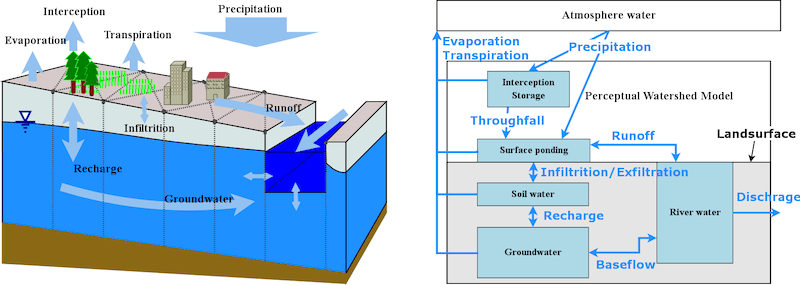

+++
title = "Fully coupled hydrological modeling with SHUD @HSGG"
date = 2020-03-12T00:15:00-16:00
draft = false

# Tags and categories
# For example, use `tags = []` for no tags, or the form `tags = ["A Tag", "Another Tag"]` for one or more tags.
tags = ["poster", "AGU", "SHUD", "SHUDtool"]
categories = []

# Featured image
# To use, add an image named `featured.jpg/png` to your page's folder.
[image]
  # Caption (optional)
  caption = ""

  # Focal point (optional)
  # Options: Smart, Center, TopLeft, Top, TopRight, Left, Right, BottomLeft, Bottom, BottomRight
  focal_point = ""
+++

### Abstract:
Hydrological modeling is an essential strategy for understanding natural flows, particularly where observations are lacking in either space or time, or where topographic roughness leads to a disconnect in the characteristic timescales of overland and groundwater flow. Simulator for Hydrologic Unstructured Domains (SHUD) is an integrated multi-process, multi-scale, multi-timestep hydrological model, in which hydrological processes are fully coupled using the semi-discrete Finite Volume Method. The SHUD integrates overland flow, snow accumulation/melting, evapotranspiration, subsurface and groundwater flow, and river routing, while realistically capturing the physical processes in a watershed.
This seminar introduces the design of SHUD, the conceptual and mathematical description of hydrological processes in a watershed. Two SHUD modeling applications demonstrate the modeling of water storage in Central Valley of California and inundation area under Harvey Hurricane.
The possible applications of then SHUD model include hydrological studies from the hillslope to regional scale, stormwater management, and water-driven coupling researches. In general, SHUD is a valuable scientific tool for any modeling task involving simulating and understanding the hydrological response.

### Speaker Bio:  
Lele Shu is a postdoctoral researcher in the Department of Land, Air and Water Resources, UC Davis. He obtained a Ph.D. degree in Water Resource Engineering and a minor degree of Computational Science from Pennsylvania State University in 2017. He developed the Simulator for Hydrologic Unstructured Domains (SHUD) model. His research interest includes the computational distributed hydrological model, integrated Coupled Nature-Human System modeling, the impact of landuse and climate change, and hydrology-remote-sensing data mining.

**Address:** PES 3001, UC Davis

**Time:** 3:00 - 4:00 PM, Mar 12, 2020.
