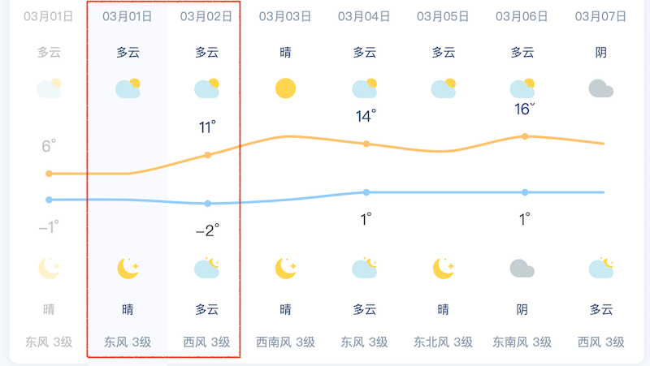

---
# Page title
title: SHUD model Hackthon （2021-03-02, Lanzhou）

# Title for the menu link if you wish to use a shorter link title, otherwise remove this option.
linktitle: Agenda

# Page summary for search engines.
summary: 2021-03-02, Lanzhou

# Date page published
date: 2021-03-01

# Academic page type (do not modify).
# type: book
# Position of this page in the menu. Remove this option to sort alphabetically.
weight: 001
---

## 概况
SHUD模型团队与青海省气象科学研究所研究人员在兰州展开交流活动，旨在通过合作交流扩展SHUD模型在青海省的科研应用。
本次研讨会预期参会者可了解SHUD模型基本原理和结构，了解SHUD的模拟能力和效果；通过实际操作，掌握SHUD模型的程序安装、模型源代码编译、数据制备、数据分析，可视化以及模型参数校准方法等。

**Location**: Build #7 , Room 712

**Time**: 2021/3/2 - 3/3

*Support*：[shulele@lzb.ac.cn](mailto:shulele@lzb.ac.cn)

## 日程安排

| 日期  | 时间          | 内容安排           |
| --------------- | ----------------------- | ---------------------------- |
| 03-02 | 09:00 - 9:30  | 介绍交流           |
|       | 09:30 - 10:30 | 报告：数值模型发展与未来 （舒乐乐） |
|       | 10:30 - 11:45 | 茶歇               |
|       | 11:45 - 12:00 | 程序安装与准备 (R, GIS, C++, GDAL)     |
|       | 12:00 - 14:00 | *午休*   |
|       | 14:00 - 15:45 | SHUD模型模拟实例   |
|       | 15:45 - 16:00 | *茶歇*             |
|       | 16:00 - 18:00 | 建模实践           |
|       |   |             |
| 03-03 | 09:00 - 10:30  | CMA-ES模型校准           |
|       | 10:30 - 11:45 | 茶歇               |
|       | 11:45 - 12:00 | 研究区域数据配置     |
|       | 12:00 - 14:00 | *午休*   |
|       | 14:00 - 15:45 |  数据分析和可视化  |
|       | 15:45 - 16:00 | *茶歇*             |
|       | 16:00 - 18:00 | 自由讨论           |

## 资源列表：
- **Model description**： [https://gmd.copernicus.org/articles/13/2743/2020/](https://gmd.copernicus.org/articles/13/2743/2020/)
- **SHUD Model**：[https://www.shud.xyz/](https://www.shud.xyz/)
- **SHUD user manual:** [html<i class="fas fa-external-link-alt"></i>](/Book_CN)
- **Operating System**: Mac OS，Linux, Windows

## Weather

