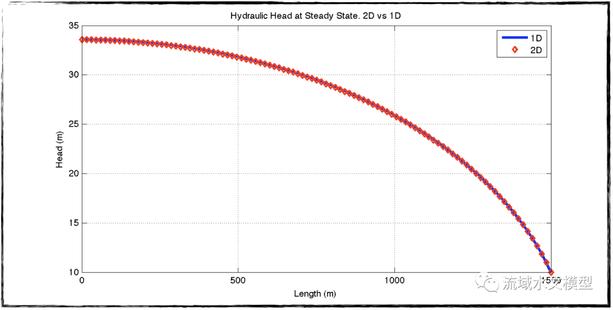

+++
title = "有限差分法证明Dupuit Assumption的不适应性场景"
date = "2022-11-24"
draft = false

# Tags and categories
# For example, use `tags = []` for no tags, or the form `tags = ["A Tag", "Another Tag"]` for one or more tags.
tags = ["Post", "SHUD", "水文模型", "教学", "数值方法"]
categories = []

# Featured image
# To use, add an image named `featured.jpg/png` to your page's folder.
[image]
  # Caption (optional)
  caption = ""

  # Focal point (optional)
  # Options: Smart, Center, TopLeft, Top, TopRight, Left, Right, BottomLeft, Bottom, BottomRight
  focal_point = ""
+++


本文是2014年秋天我在美国上课GEOSC 561： Mathematical Modeling in the Geosciences 的期末作业。作业内容学生任意想，我选了Dupuit Assumption适应性问题。先要写好proposal，然后期末的时候写完整报告。

 这个期末作业涉及了几个知识要点： 

1. 非承压地下水公式推导；

2. 非承压地下水稳定态的解析解； 

3. 非承压地下水非线性控制方程的数值求解方法； 

4. Picards循环的数值求解方法； 

5. Matlab/SciLab编程进行数值方法一维非承压地下水瞬时态流量和水头的求解； 

6. 证明Duipuit Assumption是对实际地下水流动方式的简化。  

文末有Matlab代码。


## Abstract

In Dupuit–Forchheimer assumption, hydraulic heads along vertical direction are the same, i.e. ∂h/∂z = 0. This project starts with a 1-D groundwater flow problem to test the assumption. The hydraulic head from the analytical solution is used for the validation of 1-D and 2-D numerical schemes and to determine the vertical discretization of the 2-D scheme. The results calculated from the 2-D numerical method conflict with Dupuit–Forchheimer assumption. (1) Groundwater flow horizontally and vertically instantaneously and (2) in a moving groundwater system, hydraulic heads change gradually along the vertical direction.

## Proposal

Under the DupuitForchheimer assumption, the flow in an unconfined aquifer is horizontal or parallel to bedrock. The pressure along the vertical direction is a linear function of height z. Vertical hydraulic gradients along the soil column are the same. The assumption could be expressed as equations below:


This project will test this assumption and know if the assumption is valid in various scenarios. In Dupuit–Forchheimer assumption, groundwater flows horizontally. It is a one-dimension of groundwater flow. Then a two-dimension(horizontal and vertical) scheme will be used to solve the same problem to see the difference between 1-D and 2-D schemes.

Governing equations for 1D and 2D problems are equation (3) and equation (4), respectively. 


The profile of the hydraulic head at a steady state is calculated with the 1D scheme and then apply the profile to the 2D scheme. In the 2D scheme, the hydraulic head along the z direction is a function of N ∗ ∆z(i) and ∂h/∂z = 0. Because the hydraulic head varies along x, the ∆z(i) changes along x direction while the number of nodes along z direction N doesn’t change. In the 2D scheme, groundwater flows along x and z at the same time(figure 2) . The streamline of water flow should be curved as the ones in Figure 3.


## Solution


### 1. Introduction

Under the Dupuit–Forchheimer assumption, the flow in an unconfined aquifer is horizontal or parallel to bedrock. The pressure along the vertical direction is a linear function of height z. Vertical hydraulic gradients along the soil column are the same. The assumption is expressed as equations (1) and (2).

This project will test this assumption and know if the assumption is valid. In Dupuit- Forchheimer assumption, groundwater flows horizontally, which is one dimension of groundwater flow. Hydraulic head horizontal distribution is get from analytical and 1-D numerical methods. Then a two-dimension(horizontal and vertical) scheme will be used to solve the same problem to see the difference in stream flow between 1-D and 2-D

As a well-posed problem, the calculation is a

pplied to an unconfined aquifer with a length of L = 1500m and infinite soil depth, while the recharge at the top of the water table is a constant rate R[m/s]. There is impermeable rock at the left boundary x = 0 and the bottom of the domain (z = 0). Datum starts from z = 0. Hydraulic head at the right boundary h(x = L) = H. Left boundary is a Von Neumann boundary condition where qx(x = 0) = 0. Neither sources nor sinks appear in this domain. Horizontal and vertical conductivity (kx,kz) are constant numbers and are homogeneous. Specific yield sy (dimensionless)of soil is uniform in the domain.

### 2. 1-D scheme

Based on the Dupuit–Forchheimer assumption that the hydraulic head is identical anywhere inside of a column, the hydraulic head in a column with a length of ∆x does not change with depth, i.e. ∂h/∂z = 0. The scheme of 1-D groundwater flow is in figure 2.


The derivation starts from the mass balance in a control volume:


Applied all given assumptions, the governing equation is obtained (see the step-by-step derivation in Appendix A).


#### 2.1 Analytic solution at steady state 

Because the governing equation is nonlinear, there is no way to acquire the hydraulic head function of space and time. However, the function at a steady state can be deduced from the known boundary conditions. Boundary conditions are qx(x = 0) = 0 andh(x = L) = H, so the analytical solution at steady state(derivation is in Appendix A) is:


Applied two boundary conditions, the hydraulic head profile is calculated(figure 3). The results of analytical and numerical methods at steady state will be compared.

#### 2.2 Numerical solution

One way to calculate the hydraulic head at a steady state is to derivate the numerical scheme of the steady state; another option is to run a transient numerical scheme until it reaches the steady state. The latter is more complex than the former. The latter, however, is more useful for testing the stability and consistency of numerical schemes, so it is applied in this project.

Governing equation of 1-D unconfined groundwater flow at steady state (equation 5) is a nonlinear formula. Therefore, a special algorithm Picards method (Appendix B) will be applied in the numerical method.

Instead of defining a number of Picard loops, a threshold for error in Picard's loop is given,ε = 1e − 5. As long as an error in Picard's loop is smaller than ε in the current time step, the calculation will move to the next time step.

With ∆t = 5d, initial condition h(t = 0) = 10m and threshold of testing steady-state Σ|∆h| < 1e − 6, the system reaches a steady state when t = 16115days. Comparison (figure 3) of the results of analytical and numerical methods valid the stability and consistency of the numerical scheme.


### 3. 2-D scheme

Derivation of governing equation for 2-D groundwater flow is from the mass balance as well. Governing equation for 2-D flow is equation (6). The full steps of derivation are in Appendix C.


At steady state ss * ∂h/∂t =  0. The profile of the hydraulic head at steady state is calculated with the 1D scheme, then apply the profile to the 2-D scheme to compute specific discharge along x and z directions.

Because the hydraulic head varies along x, the ∆z(i) changes along the x direction while the number of nodes along the z direction, N, doesn’t change (figure 4). Details of the 2-D scheme are described in Appendix D.


### 4. Results and Discussion

The properties of the domain are described in table 1.


#### 4.1 Consistency of 2-D scheme

First of all, the consistency of the 2-D scheme is necessary for further discussion. Hydraulic heads in the 2-D scheme are calculated with different ∆zi at different locations of x. It is a steady state and the same boundary conditions are applied to this numerical method. The hydraulic heads in the grid consist of ∆x and ∆zi and are subjected to conductivities, recharge rate, and fixed hydraulic heads at the right boundary. The only variable determined by the 1-D scheme is the value of ∆zi. Because of the steady state,  the hydraulic head height of the two schemes is the same. Figure 5 proves the consistency of the scheme.



Water balance in the domain is a crucial factor in determining consistency. Total recharge on top of the soil must be equal to the discharge at the right open boundary. The difference is R − Q = O(10−9), which is in such a small magnitude that the error can be considered a truncation error in Matlab.


#### 4.2 Hydraulic head distribution

In Dupuit–Forchheimer assumption, the hydraulic head is constant in the vertical direction, i.e. ∂h/∂z = 0. But the result in the 2-D scheme does not agree with the assumption. The left of figure 6 shows the hydraulic head distribution, which matches the Dupuit– Forchheimer assumption. Hydraulic heads in the column do change with depth (in the right of figure 6) because the change along depth is too small to be evident on contour.


#### 4.3 Specific discharge in 2-D

Another goal of this project is to determine how the groundwater moves in an unconfined aquifer. In the 1-D case, water flow along the x-direction only i.e. qx is the only specific discharge. In contrast, groundwater in 2-D flows along x and z at the same time. Figure 7 shows the contour plot of qx and qz. Figure 8 is the streamline in a steady state; water flows along x and z directions at the same time. At the open boundary(right boundary), qx is dominant, while qz is dominant at the left boundary.


### 5 Conclusion

1. Picard's method is capable of solving nonlinear groundwater flow in an unconfined aquifer. Moreover, it is stable and consistent. The error between the analytical solution and numerical method with Picard's loop is small and validates the approach.

2. Implicit numerical method is applied for the hydraulic head of steady state, which is stable and consistent based on comparison with analytical solution and water balance.

3. The Dupuit–Forchheimer assumption ∂h/∂z= 0 is not always valid. In some cases, a two-dimensional scheme is more realistic for simulating groundwater flow, such as pollution transport in groundwater.


## Code


主程序：

```
clear;
more off;
fn='pic/';

disp('======Program Start=============');
R=2/365;;  %m/day
kx=12;  %m/day
kz=20;  %m/day
Rf=@(x)R.*ones(size(x));
fkx=@(x)kx.*ones(size(x))
fkz=@(x)kz.*ones(size(x))

h0=10;  %initial condition

%------geometric--------
sy=0.40;  %Specific yield
n=100;
L=1500;
N=n+1;
M=N;
m=M-1;
dx=L/n;
x1=0:dx:L;
x2=repmat(x1,M,1);
%======================================= =======================================
% 1D STEADY STATE
[h,T]=SteayState(L,h0,fkx,Rf,n,sy);
disp('======End of 1D Numerical Scheme=============');

ana=@(R,k,L,H,x)sqrt( R./k.*(L^2-x.^2)+H.^2   );
ha=ana(R,kx,L,h0,x1);
clf();
plot(x1,h,'bd-','linewidth',2,'markersize',5);
hold on;
plot(x1,ha,'r-','linewidth',2);
xlabel('Distance (m)');
ylabel('Hydraulic head above datum (m)');

daspect([40,1,1])
set(gcf,'paperunits','centimeters')
set(gcf,'papersize',[24,8])
set(gcf,'paperposition',[0,0,24,8])

legend(['Numerical at T=',num2str(T),'days'],'Analytical');
err=sum(abs(h-ha'));
text(L/5,min(h)+(max(h)-min(h))/3,['Total error=',num2str(err)]);
print('-dpng','pic/1dhead.png');

disp('======End of 1D=============');
set(gcf,'papersize',[24,12])
set(gcf,'paperposition',[0,0,24,12])

[h2,qx,qz,kx,kz]=head2d(L,h,fkx,fkz,Rf);
disp('======End of 2D=============');


fprintf('\nWater balance of 2D\n');
Q=sum(qx(:,end)*(h(end)+h(end-1))/2/100);
TR=R*L;
dQ=TR-Q;
fprintf('Rainfal(m^2/d)=%g \t Discharge(m^2/d)=%g Differenc(m^2/d)= %g \n',TR,Q,dQ );
fprintf('\n=====END Water balance of 2D========\n');

% 2D head vs 1D head
clf();
plot(x1,h,'linewidth', 3);
xlabel('Length (m)');
ylabel('Head (m)');
title('Hydraulic Head at Steady State. 2D vs 1D');
grid on;
hold on;
plot(x1,h2(1,:),'rd', 'linewidth', 2);
legend('1D','2D');
saveas(1,strcat(fn,'ss2d.png'));

dz=h'./n;
z2=repmat(h',M,1)-(0:n)'*dz;
subqx=qx(1:m,:);
subqz=qz(:,1:n);
subx2=x2(1:m,1:n);
subz2=z2(1:m,1:n);
% Steamline
clf();
strline(subx2,subz2,subqx,subqz,20);
saveas(1,strcat(fn,'streamline.png'));

%contour of head
clf();
hold off;
subplot(1,2,1);
contourf((x2+1),z2,(h2))
%set(gca,'yscale','log')
xlabel('Length (m)');
ylabel('Head (m)');
title('Hydraulic Head at Steady State(m)');
colormap;
colorbar('Southoutside');
subplot(1,2,2);
plot(h2(:,1:5));
%set(gca,'yscale','log')
xlabel('# of nodes along z');
ylabel('Head (m)');
title('Hydraulic Head of 1-5th columns');
saveas(1,strcat(fn,'contour.png'));

clf();
subplot(1,2,1)
hold off;
contourf((x2(1:M,1:n)),z2(1:M,1:n),qx)
xlabel('Length (m)');
ylabel('Height (m)');
title('q_x (m/day)');
colormap;
colorbar('Southoutside');
%saveas(1,strcat(fn,'contourofqx.png'));

subplot(1,2,2) 
hold off;
contourf((x2(1:m,1:N)),z2(1:m,1:N),qz)
xlabel('Length (m)');
ylabel('Height (m)');
title('q_z (m/day)');
colormap;
colorbar('Southoutside');
saveas(1,strcat(fn,'contourofq.png'));
%saveas(1,strcat(fn,'contourofq.png'));
return
```

稳定态计算

```
function [h,T]=SteayState(length,h0,fkx,Rf,nx,sy)
%h0=10;  %initial condition

%kx=12;  %mzR/day
%kz=20;  %m/day
%R=1/365;  %m/day
%------geometric--------
%nx=30;
%length=1500;
dx=length/nx;
N=nx+1;
ax=0:dx:length;
R=Rf(ax);
kx=fkx(ax);
dt=5;
z2=h0;  %depth at outlet.
%initial system
ph=h0.*ones(N,1);
eps=1e-5;
beta=(2*sy*dx^2./kx./dt)';
eeta=(2*dx^2.*R./kx)';
t=1;
TN=50000;
H=zeros(N,TN);
while t<TN;    
    err=1;
    i=1;
%picard loop
  d=beta.*ph+eeta;
  d(N)=h0;
    pph=ph;
    while err>eps  
        a=-[ph(1:N)];
        b=2.*ph+beta;
        c=-[ph(1:N)];
        a(nx)=0;
        c(2)=c(2).*2;
        b(N)=1;

        A=spdiags([a,b,c],[-1,0,1],N,N);
        d;
        full(A);
        h=A\d;
        ph(N)=h0;
        err=abs(sum(h-ph));
        ph=h;
    end
%  clf();
%  plot(ax,ph);pause(0.1)
%  title('Hydraulic Head at Steady State');  
    sta=sum(abs(pph-h));
    time=t*dt;

    %input('go?');
    H(:,t)=h;
    if sta<1e-6
        break;
    end
    t=t+1;
end
sta
%plot(ax,H(:,1:t));

%head=H(:,t);
dlmwrite('head.txt',H(:,t));
%[x]=xzdim(length,head, kx,kz,R)
kbar=(2.*kx(1:nx).*kx(2:N)./(kx(1:nx)+kx(2:N)))';
q=kbar.*(h(1:nx)-h(2:N))./dx;
disp('Complete 1D STEADY STATE part.')
disp('Output is Head(h) and Specific Discharge(q).')
disp('------------------------------------------')
fprintf('\n\n\n');
T=dt*t;
end
```

函数-2D求解

```
function [x,qx,qz,kx,kz]=head2d(length,H,fkx,fkz,Rf)
%------geometric--------
N=size(H,1);
n=N-1;
M=N;
m=M-1;
dx=length/n;
dz=(H./m)';
h=repmat(H',M,1);
temp=0:n;
h=h-temp'*dz;
bnd=ones(M,N);
bnd(:,N)=0; %0 for fixed bnd
bnd(:,1)=2; %2 for right no-flux boundary.
bnd(M,:)=3; %3 for bottom no-flux bnd.
vbnd=reshape(bnd,M*N,1);
ax=repmat(dx*(0:n),M,1);
mdz=repmat(dz,M,1);  
dzbar=(mdz(:,1:n)+mdz(:,2:N))./2;
az=h;
kx=fkx(ax);   %Transmissivity of x direction
kz=fkz(az);  %transmissivity of z direction

R=Rf(dx.*(1:N));
kxbar=2.*kx(:,1:n).*kx(:,2:N)./(kx(:,1:n)+kx(:,2:N));
kzbar=2.*kz(1:m,:).*kz(2:M,:)./(kz(1:m,:)+kz(2:M,:));

ma=[zeros(M,1),dzbar].*[zeros(M,1),kxbar]./dx^2;
me=[dzbar,zeros(M,1)].*[kxbar,kx(:,N)]./dx^2;
mb=[zeros(1,N);kzbar]./mdz.^2;
md=[kzbar;zeros(1,N)]./mdz.^2;
%Bottom NO-Flux Boundary.
%mb(M,:)=mb(M,:).*2;
% Right NO-Flux boundary. X direction dh/dx=0; hi-1.j=hi+1.j
%me(1,:)=me(1,:).*2;
% lift FIXED boundary.  
me(:,N)=me(:,N)+1;

mc=-(ma+mb+md+me);
mc(:,N)=1;
ma(:,N)=0;
mb(:,N)=0;
md(:,N)=0;
me(:,N)=0;

a=reshape(ma,M*N,1);
b=reshape(mb,M*N,1);
c=reshape(mc,M*N,1);
d=reshape(md,M*N,1);
e=reshape(me,M*N,1);
%Top recharge.
w=zeros(M,N);
w(1,:)=-R.*ones(1,N);
w(:,N)= H(N).*ones(M,1);
f=reshape(w,M*N,1);

%Matrix A
temp=[e,d,c,b,a];
loc=[-M,-1,0,1,M];
A=spdiags(temp,loc,M*N,M*N);
A=transpose(A); 
Sum=full(sum(A'));
x=reshape(A\f,M,N);
%======================== ======================== ========================
%xdir=0:dx:length;
%plot(xdir,x');
%xlabel('Length');
%ylabel('Hydraulic Head');
%input('go on? 1 ');
%title('Head distribution');
%saveas(1,'head.png');
dhdx=(x(:,1:n)-x(:,2:N))./dx;
dhdz=(x(1:m,:)-x(2:M,:))./repmat(dz,m,1);
zbar=repmat(0.5.*(dz(1:m)+dz(2:M)),M,1);

qx=kxbar.*dhdx;
qz=kzbar.*dhdz;
dlmwrite('head2d.txt',x);
dlmwrite('qx.txt',qx);
dlmwrite('qz.txt',qz);
%Qx=qx.*zbar;
%Qz=qz.*dx;

%xdir=repmat(dx/2:dx:length-dx/2,M,1);
%zdir=h(:,1:n);%
%normal=repmat(max(qx),M,1);
%nqx=qx./normal;
%%nqx=nqx(:,1:n-1);
%plot(nqx,zdir);
%ylabel('depth');
%xlabel('qxi/Max(qxi)');
%title('qx');
%saveas(1,'qx.png');
%
%xcon=repmat(xdir,M,1);
%contourf(xcon,h,x);
%xlabel('Length');
%ylabel('Height');
%title('Head');
%saveas(1,'head2d.png');

disp('Complete 2D STEADY STATE part.')
disp('Output is Head(x),Specific Discharge at X(qx) and Z(qz) direction');
disp('------------------------------------------')
end
流场线绘制

function strline(x,z,u,v,N)
if sum(size(x)==size(z))~=2 || sum(size(u)==size(v))~=2
    disp('dimensions do not match!');
    return;
end
[m,n]=size(x);
if n<=N || m <=N
    disp('5th input should be smaller than size of others');
    printf('Size of them is %g,%g, but N=%g\n',m,n,N);
    N=m-1;
    printf('New N is %g.\n\n',m-1);
end
dm=[1:abs(m/N):m,m];
dn=[1:abs(n/N):n,n];
X=x(dm,dn);
Y=z(dm,dn);
U=u(dm,dn);
V=-v(dm,dn);

%X=x(m-N:m,n-N:n);
%Y=z(m-N:m,n-N:n);
%U=u(m-N:m,n-N:n);
%V=-v(m-N:m,n-N:n);

clf();
pl=quiver(X,Y,U,V,'.-b','linewidth',1,'MaxHeadSize',0.2,'AutoScaleFactor',0.9)%,'AutoScale','off');
%set(pl,'linewidth',5);
set(gca,'ylim',[0,max(max(Y))+1]);
xlabel('Length (m)');
ylabel('Head (m)');
title('Streamline');
%grid on;
end
```

这些代码多年前写的。手头暂时没有Matlab，所以无法检验。如果大家试用发现代码不全，那和我联系，我把全部代码给你。