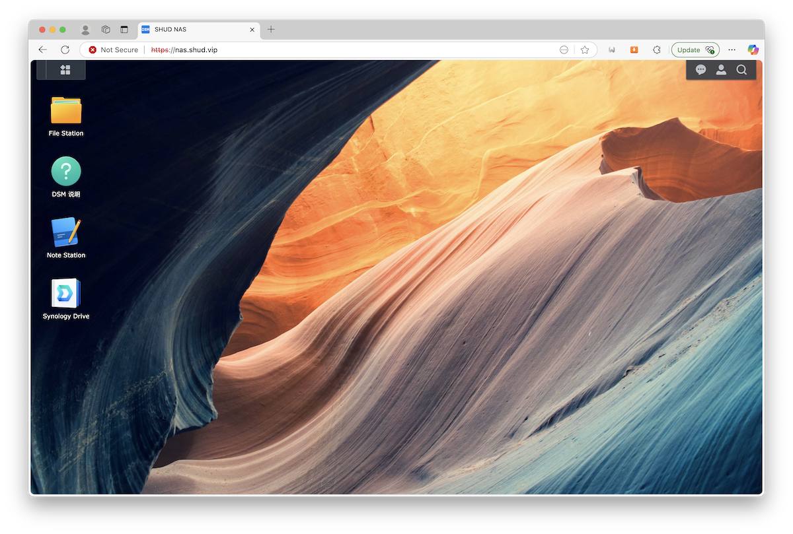

+++
title = "Synology Drive云盘, NAS, Note使用说明"
date = "2025-05-05"
draft = false

# Tags and categories
# For example, use `tags = []` for no tags, or the form `tags = ["A Tag", "Another Tag"]` for one or more tags.
tags = ["Post", "Synology", "云盘"]
categories = []

# Featured image
# To use, add an image named `featured.jpg/png` to your page's folder.
[image]
  # Caption (optional)
  caption = ""

  # Focal point (optional)
  # Options: Smart, Center, TopLeft, Top, TopRight, Left, Right, BottomLeft, Bottom, BottomRight
  focal_point = ""
+++

本文的教学视频：
【Ch1入门技能：1.1 Synology使用】https://www.bilibili.com/video/BV1nAEszAEiM?vd_source=69c40b1925e7ee6bd869b19fb46bcc18

## 主要内容

1. 账号
    1. 账户激活和登录
    2. Synology账户配置
1. Synology Drive云盘安装
    1. Home 目录
    2. Synology Drive云盘使用
    3. Synology Drive云盘共享文件
    4. Synology Drive云盘文件恢复
    5. Synology Drive云盘常见问题
2. Synology 网络存储器（NAS）使用
    1. NAS是什么
    2. NAS挂载
    3. 目录结构*
3. Synology Note使用
    1. Note是什么
    2. Note共享笔记

## 账号
首先你需要有一个账号才能使用Synology Drive云盘。 
本研究组的Synology网页：`http://nas.shud.vip`。

### 账户激活和登录
1. 访问`http://nas.shud.vip`
1. 输入账户名和密码
1. 第一次登录需要修改密码方可激活
1. 修改密码后，重新登录。

成功登录后，将看到以下页面。

### Synology账户配置

1. 访问`http://nas.shud.vip`
2. 输入账户名和密码
3. 完成账户设置

## Synology Drive云盘

### Home 目录

### 安装
1. 下载Synology Drive客户端
    - 访问`https://www.synology.cn/zh-cn/support/download/DS1821+?version=7.2#utilities`
    - 下载“Synology Drive Client”对应的操作系统版本
2. 安装Synology Drive客户端
    - Windows系统：双击安装包，按照提示完成安装
    - Mac系统：双击安装包，拖动到应用程序文件夹
    - Linux系统：根据发行版选择合适的安装方式
3. 打开Synology Drive客户端

### Synology Drive云盘同步任务
1. 打开Synology Drive客户端
2. 点击“添加任务”
3. 选择“同步任务”或“备份任务”
4. 输入NAS的IP地址和登录凭据
5. 选择要同步的本地文件夹和NAS上的目标文件夹
6. 设置同步选项（双向同步、单向同步等）,磁盘空间不足时可以选择**按需同步**。
7. 点击“应用”按钮

### Synology Drive云盘共享文件

#### 共享文件或文件夹给组内其他用户

**用户A发起共享给用户B**
1. 在Synology Drive中，选择要共享的文件或文件夹
2. 右击选择“共享”或者”Get Link“按钮
3. 在“权限”标签页，设置“隐私设置”，“受邀者列表”，输入要共享的用户的账户名或用户群组
4. 设置共享权限为“预览者”、“查看者”、“编辑者”、“管理者”四个权限之一
5. 点击“应用”按钮
6. 共享成功后，用户B的Synology Drive中会显示共享的文件或文件夹

**用户B访问共享内容**
1. 打开Synology Drive应用程序的通知栏，可以看到共享的文件或文件夹的通知
2. 点击“点击”

#### 共享文件或文件夹给无账号的外部用户
如果共享文件或文件夹给外部无账号用户，也可以公开链接，设置有效期和密码保护
1. 在Synology Drive中，选择要共享的文件或文件夹
2. 右击选择“共享”或者”Get Link“按钮
3. 在“公开链接”标签页，设置“隐私设置”、“密码包含”、“链接有效期”等信息
4. 复制“公开链接”
5. 点击“应用”按钮
6. 将“公开链接”发送给需要访问的用户
7. 其他用户可以通过“公开链接”访问共享的文件或文件夹
8. 共享的文件或文件夹可以随时取消共享，方法是右击文件或文件夹，选择“取消共享”
9. 取消共享后，其他用户将无法再访问该文件或文件夹

### Synology Drive云盘文件恢复

### Synology Drive云盘常见问题

## Synology 网络存储器（NAS）使用
### NAS是什么
### NAS挂载
### 目录结构*

## Synology Note使用

Synology Note是一个笔记应用程序，可以帮助你记录和管理笔记。它支持文本、图片、音频等多种格式的笔记，并且可以与其他人共享。

### Note共享笔记
1. 打开Synology Note应用程序
2. 创建一个新的笔记
3. 点击“共享”按钮
4. 输入要共享的用户的用户名或邮箱地址
5. 设置共享权限（只读或可编辑）
6. 点击“共享”按钮
7. 共享成功后，其他用户的Synology Note应用程序中会显示共享的笔记
8. 其他用户可以查看或编辑共享的笔记，具体取决于设置的权限
9. 共享的笔记可以随时取消共享，方法是打开笔记，点击“共享”按钮，选择“取消共享”
10. 取消共享后，其他用户将无法再访问该笔记

 